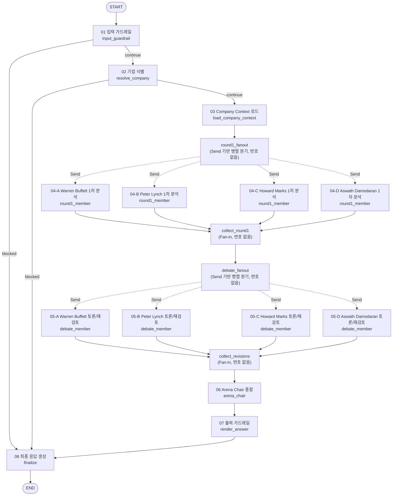

# Alpha Arena — 운영/사용 가이드 (how_to_use)

> 상태: 초안. Docker 기반 End-to-End 검증과 `evaluation/run_evaluation.py` /
> `evaluation/generate_ragas_dataset.py` + `evaluation/score_ragas_dataset.py`
> 실측이 끝나면 9~11장의 실제 출력 예시를 최신화한다. REQUIREMENTS.md §36.1을
> 따르며, 여기 적힌 모든 명령은 이 Repository의 실제 파일/경로/스크립트를
> 기준으로 한다(존재하지 않는 명령을 적지 않는다).
>
> 아래 명령은 **Windows PowerShell** 기준으로 작성되었다. macOS/Linux나 Git
> Bash를 쓴다면 `source .venv/Scripts/activate`(또는 `.venv/bin/activate`),
> `cp`, `curl`, `tail -f`, `grep` 등 해당 Shell의 명령으로 바꿔 실행한다.

## 1. 문서 목적과 대상 독자

이 문서는 Alpha Arena를 **처음 받은 개발자 또는 평가자**가 설치 → 로컬/Docker
실행 → 기능 점검 → 평가(Input-Output/RAGAS) → 문제 확인까지 스스로 재현할 수
있도록 안내한다. 서비스 자체의 목적/정책은 [SERVICE.md](../SERVICE.md), 구현
계약은 [REQUIREMENTS.md](../REQUIREMENTS.md), 결과 요약은
[README.md](../README.md)를 참고한다.

## 2. 사전 요구사항

- **Python 3.12** (Docker 이미지 기준; 로컬 개발은 3.10+ 이면 대체로 동작하나
  3.12를 권장한다)
- **Docker** (Docker 실행 절차를 검증하려는 경우)
- **AWS 계정 + Bedrock 접근 권한**: 아래 두 종류의 모델에 대한 Access가 있어야
  한다.
  - Chat 모델(`BEDROCK_MODEL_ID`) — 예: `us.anthropic.claude-sonnet-4-5-20250929-v1:0`
  - Embedding 모델(`BEDROCK_EMBEDDING_MODEL_ID`) — 예: `amazon.titan-embed-text-v2:0`
  - 최신 Claude 모델은 On-demand Model ID가 아니라 **Cross-region Inference
    Profile ID**(`us.` 또는 `global.` 접두사)가 필요할 수 있다. AWS Console의
    Bedrock → Cross-region inference에서 확인하거나, boto3로
    `bedrock_client.list_inference_profiles()`를 호출해 확인한다.
- IAM 자격 증명: `AWS_ACCESS_KEY_ID` / `AWS_SECRET_ACCESS_KEY` (또는 동등한
  자격 증명 체계)와 Bedrock `InvokeModel` 권한.

### .env 설정 방법

```powershell
Copy-Item .env.example .env
```

`.env`를 열어 최소 다음 값을 채운다(`.env`는 Git에 절대 Commit하지 않는다).

```text
AWS_ACCESS_KEY_ID=...
AWS_SECRET_ACCESS_KEY=...
AWS_REGION=us-east-1
BEDROCK_MODEL_ID=us.anthropic.claude-sonnet-4-5-20250929-v1:0
BEDROCK_EMBEDDING_MODEL_ID=amazon.titan-embed-text-v2:0
MODEL_TEMPERATURE=0
MODEL_MAX_TOKENS=8192
RAG_TOP_K=3
TRACE_FILE=logs/trace.jsonl
LOG_LEVEL=INFO
CHROMA_PERSIST_DIR=.cache/chroma
```

## 3. 프로젝트 디렉터리와 핵심 파일

```text
src/
├── config.py      # 환경변수 기반 설정(Settings 싱글턴)
├── models.py      # Pydantic 계약(Stance, InvestmentOpinion, FinalThesis 등)
├── state.py       # LangGraph State(AlphaArenaState)
├── tools.py       # Ticker 해석 + Company Snapshot 조회 + 결정론적 DCF
├── retriever.py   # data/wisdom/ → Chroma investment_wisdom 색인/검색
├── guardrails.py  # Input/Output Guardrail 정책
├── prompts.py     # Member/Debate/Chair/Judge Prompt
├── tracer.py      # 로컬 JSONL Trace
├── agent.py       # LangGraph Node/Edge 정의, Graph Assembly, run_query()
└── app.py         # FastAPI (/health, /query)

data/
├── company_snapshot.json   # 읽기 전용 Fixed Snapshot(NVDA/COST/INTC)
└── wisdom/                 # 읽기 전용 RAG Corpus(Guru별 Markdown)

evaluation/
├── test_queries.csv            # 공식 20건 평가셋(승인된 초안)
├── ragas_reference.csv         # RAGAS Reference(대표 Case 5건)
├── requirements-ragas.txt      # RAGAS 채점 전용 venv 의존성(9.2절)
├── run_evaluation.py           # Input-Output 평가 + LLM-as-Judge Runner
├── generate_ragas_dataset.py   # RAGAS 1단계: 메인 venv에서 답변/근거 수집
├── score_ragas_dataset.py      # RAGAS 2단계: 별도 venv에서 4개 지표 채점
├── round1_report.md            # Round 1 결과 리포트
└── round2_report.md            # Round 2 결과 리포트

tests/            # 결정론적 Unit Test(LLM 미호출)
Dockerfile
requirements.txt
run.sh            # 로컬 실행 스크립트(선택, Bash 전용 — Git Bash/WSL에서 사용)
```

## 4. Local 실행 절차

### 4.1 Dependency 설치

```powershell
python -m venv .venv
.venv\Scripts\Activate.ps1
pip install -r requirements.txt
```

`Activate.ps1` 실행이 "이 시스템에서 스크립트 실행이 사용하지 않도록 설정되어
있습니다" 오류로 막히면, 현재 세션에 한해 아래 명령으로 정책을 완화한 뒤 다시
시도한다.

```powershell
Set-ExecutionPolicy -Scope Process -ExecutionPolicy Bypass
```

### 4.2 Application 시작

```powershell
uvicorn src.app:app --host 0.0.0.0 --port 8000
```

이 기본 명령만으로도 `[요청]`/`[01 입력 가드레일]`/`[04-A Warren Buffett 1차
분석]` 등 번호 매겨진 콘솔 로그가 이미 출력된다 — `LOG_LEVEL`을 따로
지정하지 않으면 `src/config.py`가 기본값 `INFO`를 사용하기 때문이다(10절에서
검증). `LOG_LEVEL=DEBUG`로 더 자세히 보고 싶다면 10절의 명령을 사용한다.

(선택) Git Bash/WSL 환경이라면 `run.sh`로 venv 생성 + 설치 + 실행을 한 번에
수행할 수 있다: `./run.sh`.

### 4.3 정상 시작 확인

시작 로그에 `Uvicorn running on http://0.0.0.0:8000`이 출력되면 정상이다.
이 시점에는 아직 RAG Vector Index가 만들어지지 않는다 — 최초 `/query` 요청이
들어올 때 Lazy하게 생성된다(6절 참고).

## 5. Docker 실행 절차

### 5.1 Clean Build

```powershell
docker build -t alpha-arena .
```

`Dockerfile`은 `src/`, `data/wisdom/`, `data/company_snapshot.json`,
`requirements.txt`만 이미지에 포함한다(`data/raw/`, `.env`, `.git/` 등은
`.dockerignore`로 제외된다).

### 5.2 Container 실행 및 환경변수 주입

```powershell
docker run --rm --env-file .env -p 8000:8000 alpha-arena
```

Credential은 이미지 안에 있지 않고 `--env-file .env`로 실행 시점에 주입된다.
`docker build` 단계에서는 Bedrock을 호출하지 않으므로 Credential이 없어도
Build 자체는 성공해야 한다.

## 6. Health Check 절차

```powershell
Invoke-RestMethod -Uri http://localhost:8000/health
```

정상 응답:

```json
{"status": "ok"}
```

(참고) `curl`은 PowerShell 5.1에서 `Invoke-WebRequest`의 별칭이라 원본 curl과
옵션 문법이 다르다. Git Bash 등 실제 curl이 있는 환경이라면 `curl
http://localhost:8000/health`도 그대로 동작한다.

`/health`는 `/query`처럼 LLM/Bedrock을 호출하지 않으므로, 이 응답만으로는
Bedrock Credential이 유효한지까지는 확인되지 않는다(7절에서 확인한다).

## 7. Query 실행 절차

### 7.1 한글 깨짐 원인과 서버 측 수정

Windows PowerShell에서 `$response.answer`를 출력하면 아래처럼 한글이 깨져
보이는 문제가 실제로 재현되었다(예: "결론"이 `ê²°ë¡ `처럼 보임 — 이는 UTF-8
바이트를 Latin-1 계열로 잘못 해석했을 때 나오는 전형적인 패턴이다).

원인을 코드 기준으로 추적한 결과:

- `answer` 문자열 자체는 서버에서 이미 올바른 UTF-8로 생성된다(`FinalThesis`
  → `render_final_thesis()` → 순수 Python 문자열이며 인코딩이 개입할 지점이
  없다).
- FastAPI/Starlette의 기본 `JSONResponse`는 Body를 UTF-8 bytes로 정확히
  인코딩하지만, 응답 `Content-Type` 헤더에는 `charset`을 명시하지
  않는다(`application/json`만 내려감 — `curl -sD -`로 실측 확인).
- **Windows PowerShell 5.1**의 `Invoke-RestMethod`는 응답 `Content-Type`에
  `charset`이 없으면 UTF-8이 아닌 다른 인코딩(Latin-1 계열)으로 잘못
  해석한다 — 즉 **깨짐은 서버가 아니라 클라이언트(PowerShell 5.1)의 응답
  디코딩 단계에서 발생**한다.
- 같은 이유로 **요청을 보낼 때도** `-Body`에 담은 한글이 charset 없이는
  올바르게 UTF-8로 인코딩되지 않아(`?`로 깨짐) 서버가 질문 자체를 잘못 받는
  문제도 함께 재현되었다.

**서버 측 최소 수정**: `src/app.py`에 `UTF8JSONResponse`(모든 응답의
`Content-Type`을 `application/json; charset=utf-8`로 고정하는 `JSONResponse`
서브클래스)를 추가하고 `FastAPI(default_response_class=UTF8JSONResponse)`로
지정했다. `answer`/`contexts`/`trace` 필드나 JSON 구조는 전혀 바뀌지
않았다 — HTTP 헤더 한 줄만 명시했다. 수정 후 `POST /query`의 실제
`Content-Type` 응답 헤더는 다음과 같다(실측).

```text
Content-Type: application/json; charset=utf-8
```

이 서버 측 수정만으로 `$response.answer`의 한글 깨짐은 해결된다. 다만
**요청을 보낼 때 한글이 깨지는 문제는 클라이언트(PowerShell) 쪽에서 별도로
처리해야** 하므로, 아래 7.2절의 방법 중 하나를 사용한다.

### 7.2 PowerShell에서 요청 보내기

먼저(선택, 방어적 조치) 현재 세션의 콘솔 인코딩을 UTF-8로 맞춘다 — 오래된
Codepage(예: CP949)로 열린 콘솔 창에서 한글이 표시만 깨지는 것을 예방한다.

```powershell
[Console]::InputEncoding = [System.Text.Encoding]::UTF8
[Console]::OutputEncoding = [System.Text.Encoding]::UTF8
$OutputEncoding = [System.Text.Encoding]::UTF8
chcp 65001
```

**방법 A(권장) — Body를 UTF-8 byte 배열로 직접 인코딩.** `-ContentType`에
charset을 깜빡 잊어도 요청 인코딩이 항상 올바르므로 가장 안전하다(PowerShell
5.1에서 실측 검증).

```powershell
$questionJson = '{"question":"NVDA를 네 가지 투자 관점으로 분석해줘"}'
$response = Invoke-RestMethod `
    -Uri "http://localhost:8000/query" `
    -Method Post `
    -ContentType "application/json" `
    -Body ([System.Text.Encoding]::UTF8.GetBytes($questionJson))
```

**방법 B(더 단순) — 문자열 Body + `charset=utf-8` 명시.** `-ContentType`에
`charset=utf-8`을 반드시 포함해야 요청 본문의 한글이 깨지지 않는다(PowerShell
5.1에서 실측 검증).

```powershell
$response = Invoke-RestMethod `
    -Uri "http://localhost:8000/query" `
    -Method Post `
    -ContentType "application/json; charset=utf-8" `
    -Body '{"question":"NVDA를 네 가지 투자 관점으로 분석해줘"}'
```

**반드시 `$response = ...`로 변수에 저장한다.** 저장하지 않고 호출만 하면
콘솔에 기본 서식으로 한 번 출력되고 끝나며, 이후 `$response.answer`를 입력해도
아무것도 나오지 않는다(그 시점의 `$response`는 이전 명령과 무관한 값이거나
비어 있기 때문) — API가 answer를 잘못 반환해서가 아니라 변수에 담아두지
않은 것이 원인인 경우가 많다.

**PowerShell 5.1 vs PowerShell 7**: 이 문서의 명령은 Windows PowerShell
5.1(`$PSVersionTable.PSVersion` 5.x, 기본 `powershell.exe`)에서 실제로
재현·검증했다. PowerShell 7(`pwsh`, HttpClient 기반)은 이 환경에 설치되어
있지 않아 직접 검증하지는 못했지만, `Invoke-RestMethod`가 charset 없이도
UTF-8을 기본으로 처리하도록 개선되어 있어 방법 A/B 모두 별도 조치 없이도
더 안정적으로 동작하는 것으로 알려져 있다(공식 문서 기준 — 이 환경에서
실측하지 못했으므로 참고용으로만 표시).

**대안 — `curl.exe` 사용.** Windows 10/11에는 `curl.exe`(`C:\Windows\System32\
curl.exe`)가 기본 포함되어 있다. 단, PowerShell에서 JSON을 인라인 문자열로
직접 넘기면(`-d '{"question":"..."}'` 또는 `-d "{\"question\":\"...\"}"`)
PowerShell의 네이티브 실행 파일 인자 전달 과정에서 큰따옴표가 깨져 서버가
`JSON decode error`를 반환하는 문제를 실제로 재현했다 — 이 방식은 문서에
넣지 않는다. 대신 요청 본문을 UTF-8 파일로 먼저 저장한 뒤 `--data-binary`로
읽게 하면 안정적으로 동작한다(실측 검증).

```powershell
Set-Content -Path .\_query.json -Value '{"question":"NVDA를 네 가지 투자 관점으로 분석해줘"}' -Encoding UTF8 -NoNewline
curl.exe -s -X POST "http://localhost:8000/query" `
    -H "Content-Type: application/json; charset=utf-8" `
    --data-binary "@_query.json"
Remove-Item .\_query.json
```

### 7.3 Answer 전체 확인하기

```powershell
# 전체 answer 문자열 그대로 출력
$response.answer

# answer 길이(문자 수) 확인 — 잘렸는지 의심될 때 비교 기준으로 쓴다
$response.answer.Length

# 응답 전체를 JSON 형태로 다시 확인(중첩된 contexts/trace까지 전부 보고 싶을 때)
$response | ConvertTo-Json -Depth 10

# PowerShell 객체로서의 속성 구조를 표 대신 목록으로 확인(긴 문자열이 잘리지 않음)
$response | Format-List *

# 최상위 속성 이름만 확인
$response.PSObject.Properties | Select-Object Name

# answer를 Markdown 파일로 저장해서 에디터로 열어보기
$response.answer | Set-Content .\nvda_answer.md -Encoding UTF8
```

위 6개 명령은 모두 로컬 서버에 대해 실제로 실행해 결과를 확인했다(7.1절의
서버 측 UTF-8 수정을 적용한 뒤).

응답은 항상 다음 세 최상위 필드를 포함한다(19.2장 공식 계약).

```json
{
  "answer": "...",
  "contexts": [{"doc_id": "...", "text": "..."}],
  "trace": [{"step": "...", "input": "...", "output": "..."}]
}
```

- `answer`: Member 4명 + Debate + Arena Chair를 거친 최종 근거 기반 응답
  문자열(Markdown 형식). 별도 길이 제한이나 서버 측 자르기(truncation)는
  없다 — 코드 검토와 `TestClient`를 이용한 실측(약 1만자 응답 왕복 일치
  확인)으로 확인했다.
- `contexts`: 실제로 사용된 RAG Passage + Company Snapshot 근거(중복 제거됨).
- `trace`: `guardrail`, `resolve_company`, `company_context`,
  `retrieve_buffett/lynch/marks/damodaran`, `round1`, `debate`, `chair`,
  `output_guardrail` 등 High-level 단계 요약(19.4장). System Prompt 전문이나
  Credential은 포함되지 않는다.

최초 호출은 RAG Vector Index를 새로 만들기 때문에(수천 개 Passage를
Bedrock Titan으로 임베딩) 이후 호출보다 훨씬 오래 걸릴 수 있다. 이후 호출은
`.cache/chroma/`에 Persist된 Index를 재사용해 빨라진다.

### 7.4 응답 언어 정책

`answer`에 담기는 최종 자연어 설명은 **한국어를 기본**으로 한다. `data/wisdom/`
(RAG 원문)은 대부분 영어이고 각 Member는 영어 자료를 참고해 판단하지만,
사용자에게 노출되는 결론·설명 문장은 한국어로 정리해서 작성하도록
`src/prompts.py`의 Member/Debate/Chair Prompt에 공통 언어 규칙을 넣었다(예:
"Peter Lynch demonstrates..." 식 영어 문단을 그대로 복사하지 않고 "Peter Lynch
관점에서는 ..."처럼 한국어로 요약).

다음은 예외적으로 영어 표기를 유지하거나 병기한다 — 문장 전체를 한국어로
번역하되 아래 항목까지 억지로 한글화하지는 않는다.

- 인물/기업 고유명사: Warren Buffett, Peter Lynch, Howard Marks, Aswath
  Damodaran, NVIDIA 등
- Ticker: NVDA, COST, INTC
- 투자·재무 용어: P/E, Forward P/E, ROE, ROIC, FCF, DCF, WACC 등
- Structured Output의 Enum 값: `stance`(buy/sell/neutral/strong_buy/avoid),
  `conflict_type`(fact/assumption/valuation/risk/time_horizon) — **Pydantic
  Schema이므로 값 자체를 한글로 바꾸지 않는다.**
- Markdown 섹션 헤더의 관용 표현: `Bull Case`, `Bear Case`, `Minority View`,
  `Investment Thesis` 등(현재 `render_final_thesis()`가 만드는 헤더는 이미
  "## 5. Bull Case"처럼 한글 번호 + 영어 관용구 형태를 쓰고 있다 — 이번
  작업에서 헤더 형식을 바꾸지 않았다)

응답의 나머지 두 필드는 한국어 통일 대상이 **아니다**.

- `contexts`: 실제 RAG 근거이므로 영어 원문 Snippet을 그대로 반환해도
  정상이다(번역하지 않는다).
- `trace`(및 콘솔 로그의 `[NN 설명]` 태그 뒤 key=value, 10~13절): 기존 규칙
  그대로 유지 — 대괄호 안 단계명만 한글, `trace_id`/`ticker`/`stance`/
  `duration_ms`/`started`/`completed` 같은 기술 정보는 영어를 유지한다.

이 정책은 Prompt 지시일 뿐 결정론적으로 강제되지는 않는다 — 실제 응답이
한국어로 나오는지는 Bedrock Credential이 있는 환경에서 `/query`를 호출해
직접 확인해야 한다. 이번 작업에서는 Bedrock을 호출하지 않았으므로
`tests/test_prompt_language_policy.py`로 "Prompt에 이 규칙 문구가 실제로
포함되어 있는지"까지만 결정론적으로 검증했다(`pytest tests/ -q`).

## 8. 주요 기능 점검 절차

`POST /query` 응답의 `answer`를 열어 아래를 확인한다.

1. **4개 Member 실행 여부**: "## 3. Member별 최종 입장" 섹션에 Warren
   Buffett / Peter Lynch / Howard Marks / Aswath Damodaran Lens 4개가
   모두 존재하는지 확인한다.
2. **RAG Evidence 반환 여부**: `contexts`에 `buffett_*`, `lynch_*`, `marks_*`,
   `damodaran_*` 계열 `doc_id`가 섞여 있는지, `member` 필드가 채워져 있는지
   확인한다.
3. **Debate / Revision 동작 여부**: 서버 콘솔에서 `[05-A Warren Buffett
   토론/재검토]`부터 `[05-D Aswath Damodaran 토론/재검토]`까지 4개 Member
   모두 `started`/`completed`가 찍히는지 실시간으로 보거나(10절),
   `logs/trace.jsonl`에서 `"step": "debate"` 이벤트가 Member당 1개(총 4개)
   기록되었는지 확인한다.
4. **Minority Opinion 보존 여부**: `answer`의 "## 7. Minority View" 섹션이
   근거 있는 소수의견을 담고 있거나(있는 경우), 없다면 "확인되지 않았습니다"
   문구가 명시적으로 존재하는지 확인한다.
5. **Guardrail 동작 여부**: `evaluation/test_queries.csv`의 guardrail Case
   (G01~G03: Prompt Injection, 실거래 요청, Credential 요청)를 그대로 호출해
   차단되는지 확인한다.

## 9. Evaluation 실행 절차

### 9.1 Input-Output Evaluation + LLM-as-Judge

```powershell
python -m evaluation.run_evaluation
```

`evaluation/test_queries.csv`의 20건을 모두 실행하고, 각 Case에
LLM-as-Judge(`JUDGE_PROMPT`, Temperature 0)를 적용한다. 결과는
`evaluation/results/run_<timestamp>.json`(기계 판독용)과
`evaluation/results/run_<timestamp>.md`(사람 판독용 요약)로 저장된다. 콘솔에도
전체/Category별 Pass Rate 요약이 출력된다.

### 9.2 RAGAS

RAGAS(`ragas` 패키지)는 **메인 venv(`.venv`)와 별도의 전용 venv**에서 실행한다.
이유: scikit-network 의존성이 없는 유일한 계열인 `ragas==0.2.15`는 구버전
`langchain-community`를 요구하는데, 이는 메인 venv의 최신
`langchain`/`langgraph`/`langchain-aws` 스택과 같은 venv에 공존할 수 없다
(14절 표 참고). 그래서 두 단계로 나눈다.

**1단계 — 데이터셋 생성 (메인 venv에서 실행)**

```powershell
.venv\Scripts\Activate.ps1
python -m evaluation.generate_ragas_dataset
```

`evaluation/ragas_reference.csv`에 정의된 대표 Case마다 실제 `run_query()`를
호출해 question/answer/contexts/ground_truth를 모으고
`evaluation/results/ragas_dataset.json`에 저장한다.

**2단계 — RAGAS 채점 (별도 venv에서 실행, 최초 1회만 venv 생성)**

```powershell
python -m venv .venv-ragas
.venv-ragas\Scripts\Activate.ps1
pip install -r evaluation/requirements-ragas.txt

python -m evaluation.score_ragas_dataset
```

1단계가 만든 `ragas_dataset.json`을 읽어
`context_recall`/`context_precision`/`faithfulness`/`answer_relevancy` 4개
지표를 계산하고 `evaluation/results/ragas_<timestamp>.csv` /
`ragas_<timestamp>_summary.json`으로 저장한다. 이 스크립트는 `src.agent`를
import하지 않으므로(무거운 런타임 의존성 회피) 별도 venv에서도 문제없이
`src.config`만 재사용해 `.env`의 AWS 설정을 읽는다.

### 9.3 Round 1 / Round 2 Report 확인

측정 결과를 [evaluation/round1_report.md](../evaluation/round1_report.md),
[evaluation/round2_report.md](../evaluation/round2_report.md)에 옮겨 적는다.
Round 1과 Round 2는 반드시 동일한 Judge Model/Prompt/Temperature/Test
Dataset으로 실행해야 비교가 유효하다(21장, 25장).

## 10. 터미널에서 실행 로그 확인

Alpha Arena는 두 종류의 Observability를 **서로 대체하지 않고 둘 다** 제공한다.

- **콘솔 로그**(`src/agent.py`가 Python `logging`으로 출력): 사람이 서버를
  띄운 터미널에서 LangGraph 실행 흐름(Guardrail → Company 해석 → RAG 검색 →
  Round 1 → Debate → Chair → Finalize)을 실시간으로 눈으로 따라가기 위한 것.
- **내부 JSONL Trace**(`logs/trace.jsonl`, `src/tracer.py`): 사후 분석/평가용
  기록으로 기존 그대로 유지된다(아래 "JSONL Trace" 절 참고). 콘솔 로그를
  추가했다고 이 파일의 형식이나 내용이 바뀌지 않았다.

Console 로그의 각 줄은 `[NN 설명]` 형태의 **번호 태그**로 시작한다 — 이 번호는
`src/agent.py`의 `STEP_LABELS`(중앙 Mapping)에서 나오며, 아래 11절 Mermaid
Diagram/12절 Node 대응표와 항상 같은 번호를 쓴다. Round 1(04)과 Debate(05)는
Member 4명이 병렬 실행되므로 `04-A`~`04-D`, `05-A`~`05-D`처럼 문자를 붙여
구분한다(A=Buffett, B=Lynch, C=Marks, D=Damodaran).

### PowerShell 서버 실행

```powershell
$env:LOG_LEVEL="INFO"
uvicorn src.app:app --host 0.0.0.0 --port 8000
```

`LOG_LEVEL`은 `.env`에도 설정할 수 있다(2절 참고). 위처럼 `$env:LOG_LEVEL`로
현재 PowerShell 세션에만 임시로 지정할 수도 있다. Uvicorn 자체 로그(요청
Access Log 등)와 Alpha Arena의 `[NN 설명]` 로그는 같은 터미널에 함께
출력된다. `LOG_LEVEL=INFO`(기본값)에서는 `langchain_aws`/`boto3`/`botocore`/
`httpx`/`urllib3`가 남기는 장황한 요청/응답 로그를 WARNING 이상으로 낮춰
Alpha Arena 자체 로그가 묻히지 않게 한다(`src/config.py`) — 실제 경고/오류는
그대로 보인다.

### 별도 PowerShell에서 API 호출

7절을 참고한다 — `$response = Invoke-RestMethod ...`로 반드시 변수에 저장하고,
`-ContentType`에는 `"application/json; charset=utf-8"`을 명시한다.

### 기대 로그 예시

Guardrail/Scope 단계에서 즉시 차단되는 경우(LLM 호출 없이 실제로 발생한 로그
그대로, `LOG_LEVEL=INFO`):

```text
2026-09-02 15:19:59,938 INFO [alpha_arena] [요청] query started trace_id=5f62bc82-... query_len=9
2026-09-02 15:19:59,943 INFO [alpha_arena] [01 입력 가드레일] PASS trace_id=5f62bc82-... query_len=9 duration_ms=0
2026-09-02 15:19:59,944 INFO [alpha_arena] [02 기업 식별] failed reason=unsupported_scope trace_id=5f62bc82-... duration_ms=0
2026-09-02 15:19:59,944 INFO [alpha_arena] [08 최종 응답 생성] completed early_exit=unsupported_scope trace_id=5f62bc82-...
2026-09-02 15:19:59,945 INFO [alpha_arena] [요청] completed trace_id=5f62bc82-... early_exit=true duration_ms=6
```

("TSLA 분석해줘"처럼 정책 위반이 아니라 지원 기업을 식별하지 못한 경우다 —
`01 입력 가드레일`은 통과(PASS)하고, `02 기업 식별`에서 `failed`로 멈춘다.
실거래 요청/Prompt Injection처럼 `01`에서 바로 막히는 경우는 `[01 입력
가드레일] blocked reason=...` 다음 바로 `[08 최종 응답 생성]`으로 넘어간다.)

지원 기업 분석처럼 전체 파이프라인이 실행되는 경우, 구현된 로그 형식은
다음과 같다(Round 1과 Debate는 4개 Member가 실제 Send 기반 병렬 실행이므로
완료 순서가 호출마다 달라질 수 있다 — 순서를 강제로 맞추지 않는다. 아래는
형식을 보여주기 위한 예시일 뿐이며, 실제로는 Peter Lynch나 Damodaran이 먼저
끝날 수도 있다).

```text
[요청] query started trace_id=<id> query_len=24
[01 입력 가드레일] PASS trace_id=<id> query_len=24 duration_ms=0
[02 기업 식별] completed ticker=NVDA trace_id=<id> duration_ms=0
[03 Company Context 로드] completed ticker=NVDA trace_id=<id> duration_ms=3

[04-A.1 Warren Buffett RAG 검색] completed chunks=3 trace_id=<id> duration_ms=210
[04-A Warren Buffett 1차 분석] started trace_id=<id>
[04-B.1 Peter Lynch RAG 검색] completed chunks=3 trace_id=<id> duration_ms=198
[04-B Peter Lynch 1차 분석] started trace_id=<id>
[04-C.1 Howard Marks RAG 검색] completed chunks=3 trace_id=<id> duration_ms=205
[04-C Howard Marks 1차 분석] started trace_id=<id>
[04-D.1 Aswath Damodaran RAG 검색] completed chunks=3 trace_id=<id> duration_ms=201
[04-D Aswath Damodaran 1차 분석] started trace_id=<id>

[04-B Peter Lynch 1차 분석] completed stance=buy confidence=0.78 trace_id=<id> duration_ms=7640
[04-D Aswath Damodaran 1차 분석] completed stance=avoid confidence=0.75 trace_id=<id> duration_ms=8010
[04-C Howard Marks 1차 분석] completed stance=neutral confidence=0.62 trace_id=<id> duration_ms=8320
[04-A Warren Buffett 1차 분석] completed stance=neutral confidence=0.65 trace_id=<id> duration_ms=8210

[05-A Warren Buffett 토론/재검토] started trace_id=<id>
[05-B Peter Lynch 토론/재검토] started trace_id=<id>
[05-C Howard Marks 토론/재검토] started trace_id=<id>
[05-D Aswath Damodaran 토론/재검토] started trace_id=<id>

[05-B Peter Lynch 토론/재검토] completed changed_view=False revised_stance=buy trace_id=<id> duration_ms=6020
[05-A Warren Buffett 토론/재검토] completed changed_view=False revised_stance=neutral trace_id=<id> duration_ms=6120
[05-D Aswath Damodaran 토론/재검토] completed changed_view=False revised_stance=avoid trace_id=<id> duration_ms=6210
[05-C Howard Marks 토론/재검토] completed changed_view=False revised_stance=neutral trace_id=<id> duration_ms=6340

[06 Arena Chair 종합] started trace_id=<id> ticker=NVDA
[06 Arena Chair 종합] completed verdict=neutral confidence=0.7 trace_id=<id> duration_ms=9840

[07 출력 가드레일] PASS trace_id=<id> duration_ms=5
[08 최종 응답 생성] completed trace_id=<id>
[요청] completed trace_id=<id> early_exit=false duration_ms=48210
```

### DEBUG 로그 사용법

```powershell
$env:LOG_LEVEL="DEBUG"
```

DEBUG에서는 INFO의 모든 로그에 더해 `langchain_aws`/`boto3`/`botocore`/
`httpx`/`urllib3`의 상세 로그(요청/응답 메타데이터 등)도 억제하지 않고
그대로 노출한다(`src/config.py`) — Bedrock 호출 자체를 더 깊이 조사해야 할
때 쓴다. Alpha Arena 자체 로그는 안전한 요약 문자열만 사용하며, DEBUG에서도
System Prompt/RAG 원문/Structured Output 전체를 그대로 찍지 않는다.

### 로그에서 확인할 수 있는 단계

번호와 실제 LangGraph Node의 대응은 12절 표를 기준으로 한다. 요약:

- 요청 경계(Graph 밖) — `[요청] query started` / `completed` / `failed`
- 01 입력 가드레일 — `[01 입력 가드레일] PASS` / `blocked reason=...`
- 02 기업 식별 — `[02 기업 식별] completed ticker=...` / `failed reason=...`
- 03 Company Context 로드 — `[03 Company Context 로드] completed ticker=...`
- 04-A~D.1 RAG 검색(Round 1 내부 Sub-step) — `[04-X.1 <이름> RAG 검색] completed chunks=...`
- 04-A~D Round 1 Member 분석 — `[04-X <이름> 1차 분석] started` / `completed` / `failed`
- 05-A~D Debate/Revision — `[05-X <이름> 토론/재검토] started` / `completed` / `failed`
- 06 Arena Chair — `[06 Arena Chair 종합] started` / `completed` / `failed`
- 07 출력 가드레일 — `[07 출력 가드레일] PASS` / `corrected reason=...`
- 08 최종 응답 생성(Finalize) — `[08 최종 응답 생성] completed` (정상) /
  `completed early_exit=<reason_code>` (차단 경로)

`round1_fanout`/`collect_round1`/`debate_fanout`/`collect_revisions`는 실제
작업이 없는 LangGraph 내부 Fan-out/Fan-in 전용 Node라 번호가 없다(12절 참고).

질문 원문은 로그에 그대로 출력하지 않고 길이(`query_len`)만 기록한다. 실패
로그(`failed`)에는 `error_type=<예외 클래스 이름>`만 남기고, Credential이나
Prompt 내용이 섞여 있을 수 있는 예외 메시지 전문은 콘솔에 출력하지 않는다.

### JSONL Trace가 기존에 존재한다면

`logs/trace.jsonl`(설정: `TRACE_FILE`, 기본값 `logs/trace.jsonl`)에 한 줄당
하나의 이벤트가 JSON으로 쌓인다. 이 파일은 위 콘솔 로그와 별개로 계속
기록되며, 콘솔 로그 추가로 형식이나 내용이 바뀌지 않았다.

```powershell
Get-Content logs/trace.jsonl -Wait -Tail 20                        # 실시간 확인
Select-String -Path logs/trace.jsonl -Pattern '"trace_id":"<id>"'  # 특정 요청 하나만 추적
```

각 이벤트는 `trace_id`, `timestamp`, `step`, `status`(ok/error), `duration_ms`,
`input_summary`, `output_summary`, `metadata`를 담는다. 파일이 없거나 쓰기에
실패해도 API 응답 자체는 실패하지 않는다(20장: Trace 실패가 서비스를
중단시키지 않음). API 응답의 `trace` 필드는 이 파일과 별개로, Safe/High-level
요약만 담는다(민감정보 없음).

## 11. LangGraph Diagram

`src/agent.py`의 `build_graph()`를 직접 조사(및 아래 13절의 `scripts/show_graph.py`
실행 결과)해서 작성한 실제 구조다. 번호는 10절 콘솔 로그·12절 대응표와 동일하다.



`round1_member`/`debate_member` 내부의 RAG 검색(04-X.1)은 별도 LangGraph
Node가 아니라 Node 함수 내부의 한 단계라서 이 Diagram에는 그리지 않는다
(10절 참고). `round1_fanout`/`collect_round1`/`debate_fanout`/
`collect_revisions`는 실제 코드에 존재하는 Node이지만 작업이 없는
Fan-out/Fan-in 전용 Node라 번호를 부여하지 않았다.

## 12. LangGraph 번호 ↔ 실제 Node 대응표

| 번호 | 실제 LangGraph Node | 설명 |
|---|---|---|
| 01 | `input_guardrail` | 입력 정책 검사(Prompt Injection/실거래 요청 차단) |
| 02 | `resolve_company` | 분석 기업 식별(NVDA/COST/INTC 결정론적 Ticker 해석) |
| 03 | `load_company_context` | Fixed Snapshot(`company_snapshot.json`) 1회 조회 |
| (없음) | `round1_fanout` | Round 1 Send 기반 Fan-out Dispatcher(작업 없음) |
| 04-A | `round1_member`(member=buffett) | Warren Buffett 독립 1차 분석 |
| 04-B | `round1_member`(member=lynch) | Peter Lynch 독립 1차 분석 |
| 04-C | `round1_member`(member=marks) | Howard Marks 독립 1차 분석 |
| 04-D | `round1_member`(member=damodaran) | Aswath Damodaran 독립 1차 분석 |
| 04-X.1 | `round1_member` 내부 `retrieve_guru_docs` 호출 | RAG 검색(별도 Node 아님) |
| (없음) | `collect_round1` | Round 1 Fan-in Barrier(작업 없음) |
| (없음) | `debate_fanout` | Debate Send 기반 Fan-out Dispatcher(작업 없음) |
| 05-A | `debate_member`(member=buffett) | Warren Buffett 토론/재검토 |
| 05-B | `debate_member`(member=lynch) | Peter Lynch 토론/재검토 |
| 05-C | `debate_member`(member=marks) | Howard Marks 토론/재검토 |
| 05-D | `debate_member`(member=damodaran) | Aswath Damodaran 토론/재검토 |
| (없음) | `collect_revisions` | Debate Fan-in Barrier(작업 없음) |
| 06 | `arena_chair` | 중립 Arena Chair 종합(FinalThesis 생성) |
| 07 | `render_answer` | 답변 렌더링 + Output Guardrail |
| 08 | `finalize` | 최종 `answer`/Safe Trace 조립(정상·차단 경로 합류점) |

Graph 구조(`src/agent.py`의 `add_node`/`add_edge`/`add_conditional_edges`)가
바뀌면 이 표, 11절 Diagram, `src/agent.py`의 `STEP_LABELS`를 함께 갱신한다
(REQUIREMENTS.md 20.1).

## 13. LangGraph 자체 Graph 출력 방법

설치된 LangGraph(1.2.11)는 컴파일된 Graph 객체에서 구조를 그대로 뽑아낼 수
있다. 아래는 LLM/Bedrock/Embedding을 전혀 호출하지 않는 순수 구조 조회다.

```python
from src.agent import get_graph

structure = get_graph().get_graph()
print(list(structure.nodes))
print(structure.draw_mermaid())
```

이를 실행 없이 바로 확인할 수 있는 보조 스크립트도 추가했다.

```powershell
python scripts/show_graph.py
```

**주의**: `round1_fanout`/`debate_fanout`은 `Send(...)`를 반환하는 동적
Conditional Edge라서, LangGraph의 정적 분석기가 실제 목적지
(`round1_member`/`debate_member`)를 추론하지 못한다. 그 결과 `draw_mermaid()`
원본 출력과 `get_graph().edges` 목록에서는 이 두 Node가 마치 `__end__`로 바로
연결되는 것처럼(그리고 `round1_member` 이후의 모든 Node가 고립된 것처럼)
나온다 — 실제 런타임 동작과 다르다. 이 문제를 고치려면 `add_conditional_edges`에
정적 `path_map` 힌트를 추가해야 하는데, 이는 Graph 정의 자체를 건드리는
변경이라 이번 작업 범위(Graph 구조 변경 금지)에서는 적용하지 않았다. 그래서
11절의 Mermaid Diagram은 `draw_mermaid()` 출력을 그대로 쓰지 않고, 소스 코드와
`scripts/show_graph.py`로 확인 가능한 정적 Edge에 실제 Send 대상(소스 코드
확인)을 더해 직접 작성했다.

## 14. 자주 발생할 수 있는 오류와 점검 방법

| 증상 | 원인 | 조치 |
|---|---|---|
| `/query`가 500을 반환한다 | Bedrock Credential 누락/오류, Model ID 접근 권한 없음 | `.env`의 AWS 값 확인, `logs/trace.jsonl`의 마지막 `status: error` 이벤트 확인 |
| `ValidationException: ... on-demand throughput isn't supported` | `BEDROCK_MODEL_ID`가 On-demand 미지원 모델의 순수 Model ID임 | Cross-region Inference Profile ID(`us.anthropic...`)로 교체 |
| `ValidationException: Too many input tokens` (임베딩) | 매우 긴 RAG Passage가 Titan Max Input Token(8192)을 초과 | 이미 `src/retriever.py`의 `_MAX_PASSAGE_CHARS` 기준으로 자동 재분할되도록 처리되어 있음 — 재현되면 `.cache/chroma/`를 삭제 후 재시도 |
| 첫 `/query` 응답이 매우 느리다 | RAG Vector Index를 최초로 생성하는 중(수천 개 Passage 임베딩) | 정상 동작. 완료 후 `.cache/chroma/`가 재사용되어 이후 호출은 빨라진다 |
| "지원 기업을 식별하지 못했습니다" 안내만 나온다 | 질문에서 NVDA/COST/INTC(및 한글/영문 별칭)를 찾지 못함 | 지원 Ticker 중 하나를 명시해서 재질문 |
| pytest에서 특정 테스트만 실패 | 로컬 환경/의존성 버전 차이 | `pip install -r requirements.txt` 재실행, `pytest tests/ -q -k <테스트이름>`으로 단독 재현 |
| `ragas`를 메인 venv에 설치하면 빌드가 실패하거나(`scikit-network`) `ModuleNotFoundError: langchain_community.chat_models.vertexai`가 난다 | 최신 `ragas`(0.3+)는 `scikit-network`를 요구해 Windows+Python 3.14에서 소스 빌드가 실패한다. `scikit-network`가 없는 구버전 `ragas==0.2.15`는 구버전 `langchain-community`(vertexai 모듈 포함)를 요구하는데, 메인 venv의 최신 `langchain-aws`/`langgraph`가 최신 `langchain-community`(0.4.x, 해당 모듈 제거됨)를 강제해 충돌한다 | 두 venv로 분리한다: 메인 venv에서 `evaluation.generate_ragas_dataset` 실행 → 별도 `.venv-ragas`(`evaluation/requirements-ragas.txt`, `ragas==0.2.15`+`langchain-aws==0.2.20`)에서 `evaluation.score_ragas_dataset` 실행(9.2절) |
| `score_ragas_dataset.py` 실행 시 `FileNotFoundError: ragas_dataset.json` | 1단계(`generate_ragas_dataset.py`)를 아직 실행하지 않음 | 메인 venv에서 먼저 `python -m evaluation.generate_ragas_dataset` 실행 |
| `RuntimeError: Timeout should be used inside a task` (RAGAS 실행 시 모든 Job 실패) | `ragas.executor`가 import 시점에 무조건 호출하는 `nest_asyncio.apply()`가 Python 3.14 asyncio 내부와 충돌 | `score_ragas_dataset.py`가 이미 `ragas` import 전에 `nest_asyncio.apply`를 no-op으로 패치해 우회하고 있음 — 직접 스크립트를 작성한다면 동일하게 패치 필요 |
| RAGAS `faithfulness`만 계속 `LLMDidNotFinishException` | `ragas==0.2.15`의 완료 판정 목록이 최신 Claude 모델의 `stop_reason` 값을 인식하지 못함 | `LangchainLLMWrapper(..., is_finished_parser=lambda r: True)`로 우회(이미 반영됨). 그래도 답변이 아주 길면 Claim 분해 JSON이 `max_tokens`를 넘겨 잘릴 수 있음 — `evaluation/round1_report.md`의 RAGAS 절 참고 |
| `ThrottlingException: Too many tokens per day` | AWS Bedrock 계정의 일일 토큰 한도 도달(반복 테스트로 누적 소진) | 한도가 회복될 때까지 대기 후 재시도. 코드 문제가 아니므로 재시도 간격을 두고 작은 호출로 회복 여부를 먼저 확인 |
| Round 1 Member/Chair Structured Output이 간헐적으로 검증 오류(`Field required`)로 실패 | 필드가 많은 `InvestmentOpinion`/`FinalThesis`가 `max_tokens` 한도 안에서 마지막 필드까지 못 채움 | `.env`의 `MODEL_MAX_TOKENS`를 늘려본다(기본 8192). REQUIREMENTS.md 29.4에 따라 1회 Retry 후에도 실패하면 `ERROR`로 정확히 분류되는 것이 정상 동작 |
| PowerShell에서 `$response.answer`의 한글이 `ê²°ë¡ `처럼 깨져 보인다 | 서버 응답 `Content-Type`에 `charset`이 없어 PowerShell 5.1이 UTF-8을 Latin-1 계열로 잘못 디코딩 | 이미 `src/app.py`의 `UTF8JSONResponse`로 수정됨(서버 재시작 필요). 그래도 재현되면 7.1절로 원인 재확인 |
| 요청을 보낼 때 한글이 `?`로 깨져 서버가 다른 질문으로 받는다(`trace`의 `input`에서 확인 가능) | PowerShell 5.1 `Invoke-RestMethod -Body`가 charset 없이 문자열을 UTF-8이 아닌 인코딩으로 전송 | 7.2절의 방법 A(byte 배열) 또는 방법 B(`-ContentType`에 `charset=utf-8` 명시) 사용 |
| PowerShell에서 `curl.exe -d '{"question":"..."}'`가 `JSON decode error`를 반환한다 | PowerShell이 네이티브 실행 파일에 인자를 전달할 때 큰따옴표를 깨뜨림(재현 확인) | 인라인 문자열 대신 7.2절의 `--data-binary "@file.json"` 방식 사용 |

## 15. 최종 제출 전 Smoke Test Checklist

- [ ] `pytest tests/ -q` 전체 통과(결정론적 46개 이상)
- [ ] `.env` 채운 뒤 로컬 `uvicorn src.app:app`으로 `/health` 200 확인
- [ ] 지원 3개 기업(NVDA/COST/INTC) 각각에 대해 `/query` 1회 이상 정상 응답 확인
- [ ] 미지원 기업/Multi-company 질문에 대해 표준 Shape의 안내 응답 확인
- [ ] Direct Prompt Injection, 실거래 요청 질문에 대해 차단 응답 확인
- [ ] `logs/trace.jsonl`에 `guardrail`~`chair`까지 주요 단계가 기록되는지 확인
- [ ] 서버 콘솔에 `[요청]`부터 `[08 최종 응답 생성]`까지 번호 로그가 실시간으로
      출력되는지 확인(10절)
- [ ] `$response.answer`가 PowerShell에서 한글 깨짐 없이 정상 출력되는지 확인(7절)
- [ ] `/query` 응답 `Content-Type` 헤더가 `application/json; charset=utf-8`인지 확인(7.1절)
- [ ] 실제 `answer`를 열어 Member/Bull Case/Bear Case/Minority View 설명이
      영어 문단 없이 한국어로 작성되어 있는지 확인(7.4절)
- [ ] `python -m evaluation.run_evaluation` 실행 후 Guardrail Pass Rate 100%,
      Overall Pass Rate ≥ 85% 확인
- [ ] `evaluation.generate_ragas_dataset`(메인 venv) → `evaluation.score_ragas_dataset`
      (`.venv-ragas`) 실행 후 4개 지표 값 확보
- [ ] `evaluation/round1_report.md` / `round2_report.md`에 실측치 반영
- [ ] `docker build -t alpha-arena .` 성공, `docker run`으로 `/health`,
      `/query` 재확인
- [ ] `README.md`의 점수/명령이 실제 실행 결과와 일치하는지 확인
- [ ] `.env`, Credential이 Git/Docker 이미지/제출 ZIP에 포함되지 않았는지 확인
